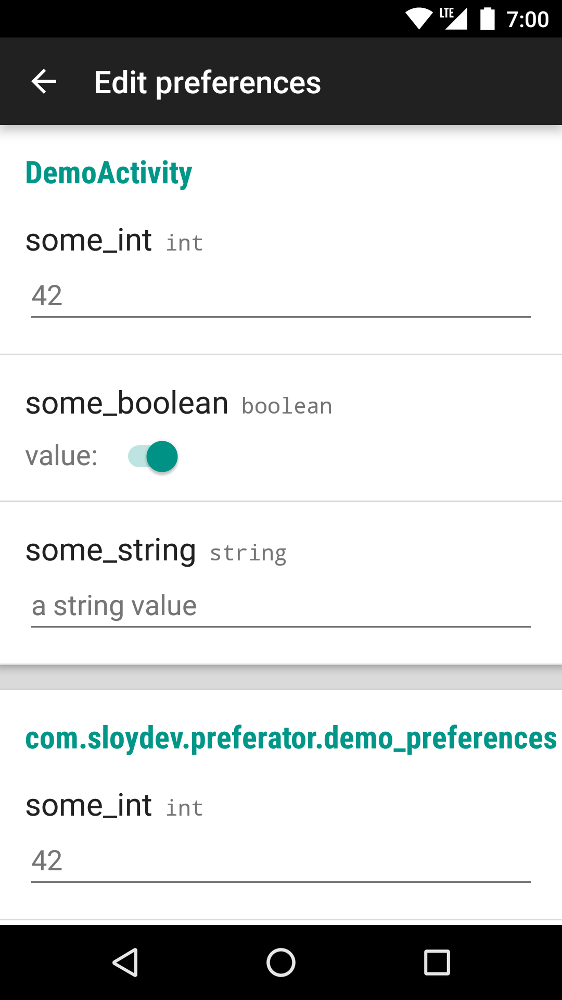

# Preferator

[](https://bintray.com/sloy/maven/preferator/) [](https://travis-ci.org/Sloy/preferator)

This Android library let's you edit your application SharedPreferences from the device itself.

# Screenshot


## Usage

It's a one-liner:

```java
// From a button click in your debug menu or something
Preferator.launch(context);
```
And you're good to go!

## Download

Add it to your build.gradle:

```groovy
dependencies{
    debugCompile 'com.sloydev:preferator:1.3.2'
    releaseCompile 'com.sloydev:preferator-no-op:1.3.2'
}
```

## License

```
Copyright 2016 Rafa Vázquez


Licensed under the Apache License, Version 2.0 (the "License");
you may not use this file except in compliance with the License.
You may obtain a copy of the License at

   http://www.apache.org/licenses/LICENSE-2.0

Unless required by applicable law or agreed to in writing, software
distributed under the License is distributed on an "AS IS" BASIS,
WITHOUT WARRANTIES OR CONDITIONS OF ANY KIND, either express or implied.
See the License for the specific language governing permissions and
limitations under the License.
```
